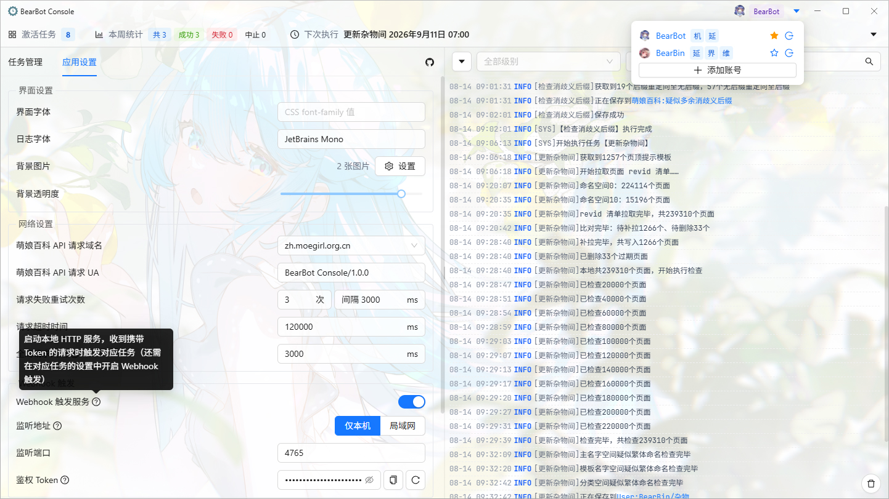
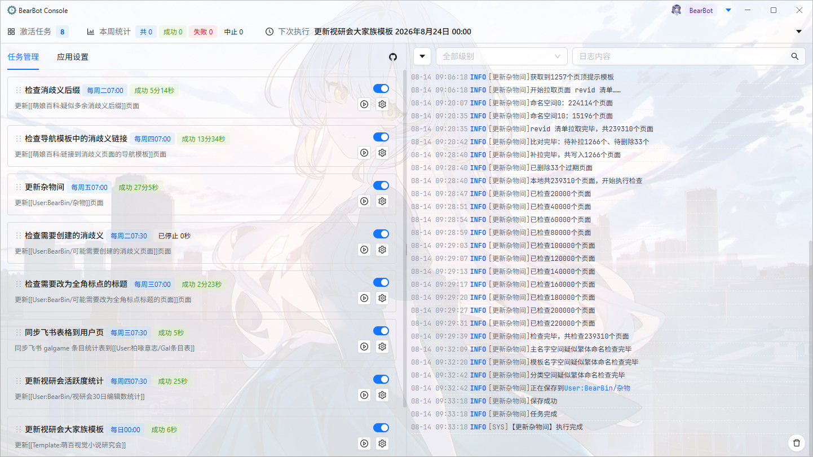
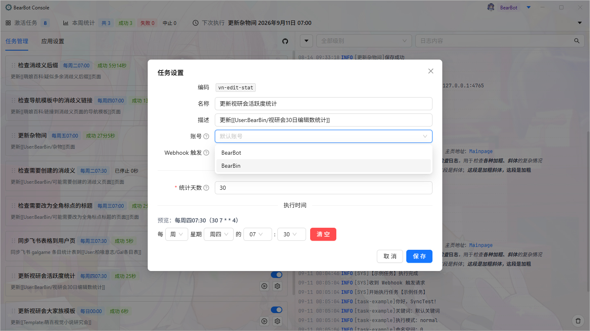
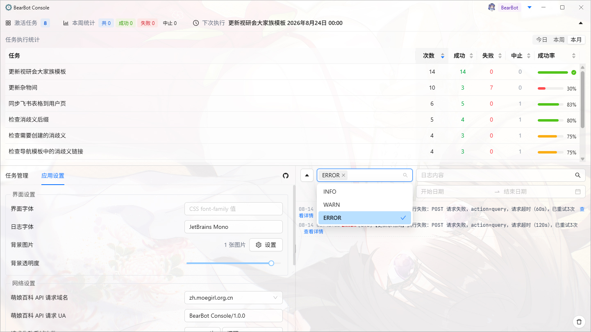

<p align="center"></p>

<h1 align="center">BearBot Console</h1>

<p align="center">BearBot 萌娘百科机器人控制台</p>

<p align="center">
  <a href="https://electronjs.org/releases/stable"></a>
  <a href="https://nodejs.org" target="_blank" rel="noopener noreferrer"></a>

  <br />
  <a href="https://github.com/BearBin1215/bearbot-console/blob/main/LICENSE" target="_blank"></a>
  
  
  
</p>

## 功能

### 网络治理

- 自选 zh/mzh 域名
- 支持设置重试、超时，可自行调整以适配萌百垃圾网络状况
- 可配置全局节流设置，避免并发太多请求伤害脆弱的萌百娘



### 任务调度

- 萌娘百科多账号管理，支持为不同任务单独设定执行账号
- 可视化配置、显示执行周期，动态配置任务参数
- 支持手动触发、手动打断，同一任务防重入
- 应用启动时检查错过任务
- 启用高频任务时确认，避免手滑




### 日志

- 日志按天持久化到本地文件，保留 30 天，超期自动清理
- 界面支持按时间、任务、类型、内容筛选，最多展示最近 200 条
- 支持在日志里写 `[[内链]]`、`'''加粗'''`、`''斜体''`，假装编辑萌百
- 任务数据汇总：统计日、周、月次数及成功率，下次执行任务及时间



### 任务脚本

详见[任务脚本添加指南](docs/add-task.md)

- 与 `mw.Api` 用法相近的 api 接口，token 缓存、失败重试开箱即用
- 任务上下文 `TaskContext` 提供`api`、`user`、`logger`、`params`、`signal`、`sleep`等对象/方法
- 从现有 TS/JS 脚本库轻松<sub>（存疑）</sub>迁移

## 说明

- 这是为一碟醋搭的一个饺子工厂。作为带有学习练手性质的程序，本应用内有较多乱七八糟的、对于机器人功能本身而言无意义的功能和性能浪费，包括但不限于：
  - 为了加上拖拽而实现背景图片功能
  - 为了品鉴electron的session分区而实现多账号管理
  - 看起来很灵活实际上脱裤子放屁的任务参数配置
- 关于“为什么不”：可能根本没有“不”，所以也没有“为什么不”。然后，先看上一点，再解释“为什么要”，最后才是问“为什么不”。
- 有较多针对萌娘百科的设计（如 API 封装），如需适用其他MediaWiki站点可能需要一定量的修改。
- **已知限制**：Windows 下，点击系统通知中心的任务完成通知恢复主窗口的功能仅在安装后可用，直接运行 unpacked 目录或 portable 版本时无法正常恢复窗口。

## 使用

本项目有三个分支：
- 主分支为干净分支，仅包含框架代码，可自行添加任务脚本并构建使用。
- [bearbot 分支](https://github.com/BearBin1215/bearbot-console/tree/bearbot)为我[个人机器人](https://mzh.moegirl.org.cn/User:BearBot)分支，包含具体任务脚本，可供参考。
- [gh-pages 分支](https://github.com/BearBin1215/bearbot-console/tree/gh-pages)为项目演示页分支，在[GitHub Page](https://BearBin1215.github.io/bearbot-console/)上模拟界面和运行效果。

### 添加机器人任务

见[任务脚本添加指南](docs/add-task.md)。

### 构建

```bash
pnpm install   # 安装依赖
pnpm dev       # 开发模式运行
pnpm build     # 构建当前平台的安装包
```

- 环境要求：[Node.js](https://nodejs.org) >= 24.15、[pnpm](https://pnpm.io)
- 构建产物位于 `release/<版本号>/` 目录，支持 Windows / Linux / macOS
- 本仓库代码推送到 `bearbot` 分支或手动触发[构建工作流](.github/workflows/build.yml)时通过 GitHub Actions 构建，请自行选择合适的构建方式。

## 开源许可

基于 [MIT License](./LICENSE) 开源，Copyright (c) 2026 BearBin。
